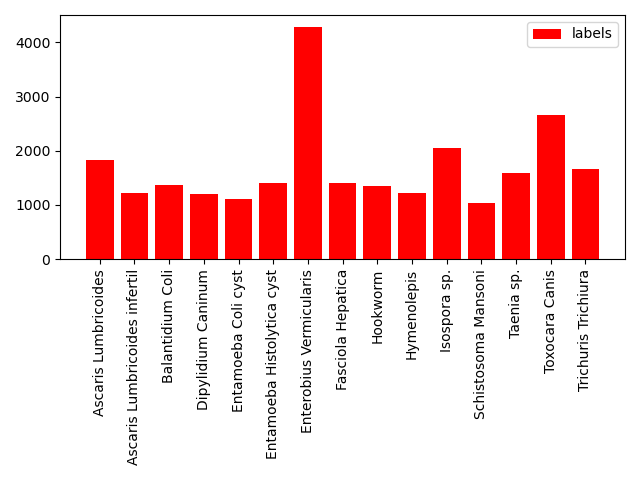

# PascalVOC-Histogram
Count dateset class and plot histograms for labeled images by PascalVOC XML format.

You should edit `path` variable in annotion_histogram.py and run the py file. 

Example result:

